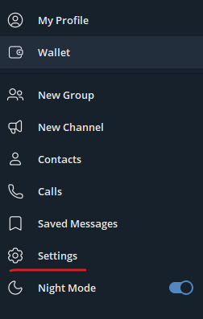
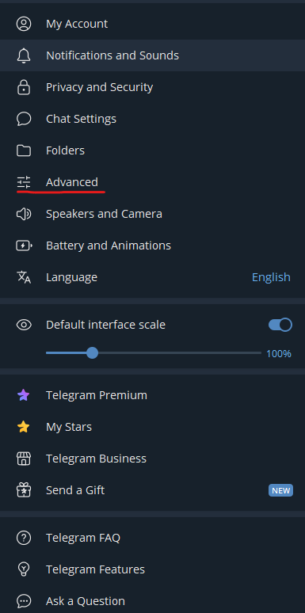
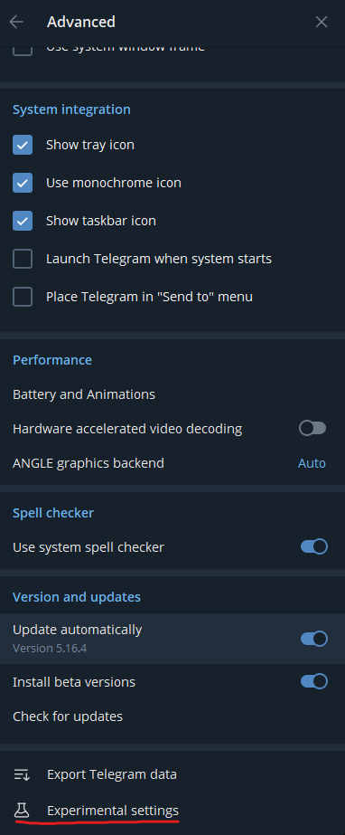
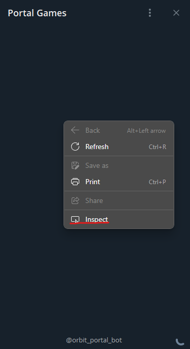

# How to enable debug mode in Telegram

  **Step 1: Download and launch the Beta Version of Telegram Desktop here** <https://desktop.telegram.org/changelog#beta-version>

  **Step 2: Open the side menu and navigate to Settings > Advanced.**  
  
  
  

  **Step 3: Scroll down the opened menu and click the Experimental settings button.**
  

  **Step 4: Check the Enable webview inspecting option.**
  

  **Step 5: When the debug mode is enabled, right-clicking in the Mini App will display a context menu with the Inspect option, allowing you to open developer tools.**
  

