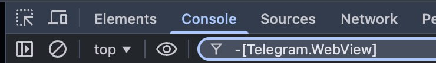

# How to Filter Telegram DevTools Messages

### Prerequisites

Before you begin, ensure you have enabled DevTools in Telegram. For detailed instructions, see [how to enable DevTools in Telegram](/integration/tg-devtools/).

### The Problem

If you see a lot of messages like this appearing every few seconds in your console:

```
[Telegram.WebView] ‹ receiveEvent accelerometer_changed
```

You can filter them out using one of the following options:

### Option 1: Filter in Chrome

This method works when you open Telegram from Windows or when debugging Android devices.

Add `-[Telegram.WebView]` filter in Chrome DevTools:



### Option 2: Insert Script into DevTools

This method works for all operating systems.

Paste the following script into your DevTools console:

=== "JavaScript"
```JS
(function() {
  const originalLog = console.log;
  console.log = function(...args) {
    if (args[0]?.includes?.('[Telegram.WebView]')) return;
    return originalLog.apply(console, args);
  };
  console.info('✅ Telegram.WebView logs disabled');
})();
```


