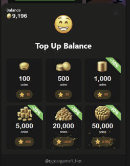

# Game & IAP Managment
## Admin dashboard

**_Note: The admin dashboard is in the pre-release stage and subject to change.
How to get access_**

1. Send command /admin to the Telegram bot  @cs_games_platform_bot
  
  2. You will get a link to the admin dashboard where you can administrate your games

How to add, edit, or remove items in-game shop

1. Select one of your games and click the store icon
  
  2. Now you can have access to change items, their description, and price in Telegram stars
  
  
Change game configuration  
  1. Change supported devices and supported screen formats

  
  2. Game name, Game description, Colors, Logo,
  
## How to use Shop API

After you create your items, you can integrate them into your game.
Here is an example for Unity, and an example for JavaScript games is coming soon.

1. First of all, you need to get all your items:
>var items = await PortalSDK.GetShopItems();

ShopItem has the same fields as in the admin, and the most important is the id
```c#
public class ShopItem
{
   /// <summary>
   /// The unique identifier of the shop item.
   /// </summary>
   public int id;

   /// <summary>
   /// The name of the shop item.
   /// </summary>
   public string name;

   /// <summary>
   /// The description of the shop item.
   /// </summary>
   public string description;

   /// <summary>
   /// The price of the shop item.
   /// </summary>
   public int price;

   /// <summary>
   /// The date and time when the shop item was created.
   /// </summary>
   public DateTime created;

   /// <summary>
   /// The date and time when the shop item was last updated.
   /// </summary>
   public DateTime updated;
}
```
2. The second important API method is:
>var purchased = await PortalSDK.GetPurchasedShopItems();

It gives you all the purchased items by the current player.   
  Now you can display your shop screen and associate your items with ShopItems from the API and mark purchased it 
If your item can be purchased infinitely, you can just not mark it. SDK API does not limit you in the number of purchased items per player.   
3. Make a code to buy an item by id
>var result = await PortalSDK.OpenPurchaseConfirmModal(itemId);
```C#
if (result is { IsSuccessful: true })
{
   // ...   
}
```

After player will see modal window:  
    
  If a user doesn't have enough balance, a top-up popup will be shown  
    
  If the player confirms a purchase, after all, you will get the response IsSuccessful = true
