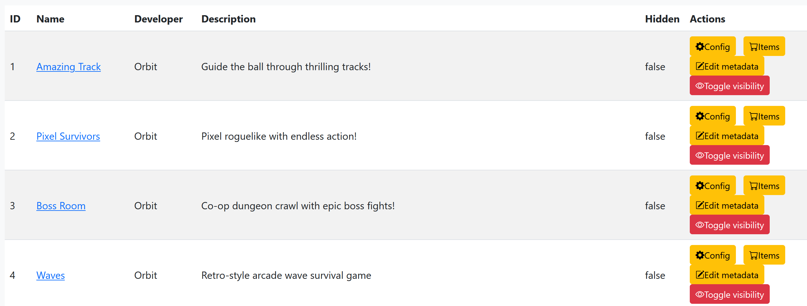
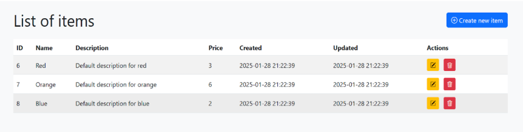
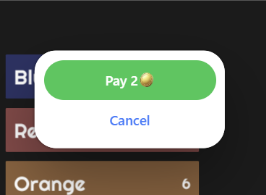
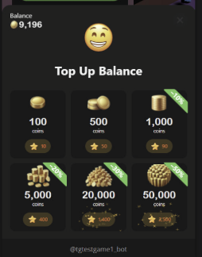

# In-game purchases
## How to add, edit, or remove items
#### [1. Get access to admin dashboard](/integration/admin-panel)
#### 2. Select one of your games and click the store button `Items`

#### 3. You have access to change items, their description, and prices
  


## How to use Shop API

After you create your items, you can integrate them into your game.   

#### 1. First of all, you need to get all your items:
=== "Unity"
	```C#
	var items = await PortalSDK.GetShopItems();
	```
=== "JavaScript"
	```js
 	const response = await PortalSDK.getShopItems();
	```
=== "Defold"
	```lua
    portalsdk.get_shop_items(function(self, data)
    end)
	```

`ShopItem` has the same fields as in the admin, and the most important is the `id`

=== "Unity"
    ```C#
    public class ShopItem
    {
        /// <summary>
        /// The unique identifier of the shop item.
        /// </summary>
        public int id;

        /// <summary>
        /// The name of the shop item.
        /// </summary>
        public string name;

        /// <summary>
        /// The description of the shop item.
        /// </summary>
        public string description;

        /// <summary>
        /// The price of the shop item.
        /// </summary>
        public int price;

        /// <summary>
        /// The date and time when the shop item was created.
        /// </summary>
        public DateTime created;

        /// <summary>
        /// The date and time when the shop item was last updated.
        /// </summary>
        public DateTime updated;
    }
    ```
=== "JavaScript"
    ```JS
    interface ShopItem {
        id: number;
        name: string;
        description: string;
        price: number;
        created: string;
        updated: string;
    }
    ```
=== "Defold"
	```lua
	local shopItem = {
	    id = 1,
	    name = "Sample Item",
	    description = "This is a sample shop item.",
	    price = 100,
	    created = "2025-06-12T10:00:00Z",
	    updated = "2025-06-12T12:00:00Z"
	}
	```

#### 2. The second important API method is `getPurchasedShopItems`:

=== "Unity"
    ```C#
    var purchased = await PortalSDK.GetPurchasedShopItems();
    ```  
=== "JavaScript"
    ```JS
    const purchased = await PortalSDK.getPurchasedShopItems();
    ```
=== "Defold"
	```LUA
    portalsdk.get_purchased_shop_items(function(self, result)
        -- shopItems
    end)
	```
It gives you all the purchased items by the current player.   
Now you can display your shop screen and associate your items with `ShopItems` from the API and mark purchased it.

If your item can be purchased infinitely, you can just not mark it.
<ins>SDK API does not limit you in the number of purchased items per player.</ins>   

#### 3\. Make a code to buy an item by `id`
=== "Unity"
	```C#
	var result = await PortalSDK.OpenPurchaseConfirmModal(itemId);
	if (result is { IsSuccessful: true }) {
        Debug.Log("Purchase successful!")
    }
    else {
        Debug.Log("Purchase failed.")
    }
	```
=== "JavaScript"
	```JS
    const shopItems = await PortalSDK.getShopItems();

    const shopItem = shopItems.find(item => item.id === itemId)

	const result = await PortalSDK.openPurchaseConfirmModal(shopItem);

    if(result.status === "success") {
        console.log("Purchase successful!")
    } else {
        console.log("Purchase failed.")
    }
	```
=== "Defold"
	```lua
    portalsdk.open_purchase_confirm_modal(itemId, function(self, result)
        if result.status == "success" then
            print("Purchase successful!")
        else
            print("Purchase failed.")
        end
    end)
	```
After player will see modal window:  
    
  If a user doesn't have enough balance, a top-up popup will be shown  
    
  If the player confirms a purchase, after all, you will get the response `IsSuccessful = true` or `status == "success"`
