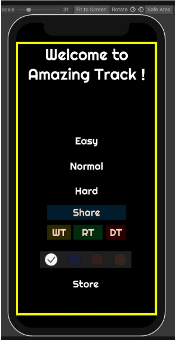
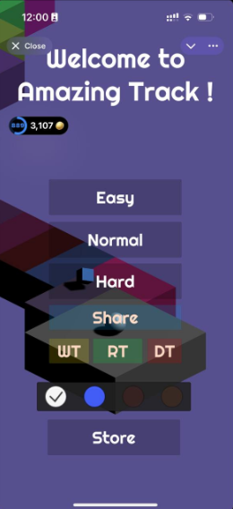

# Safe Area Guide 
A Safe Area in mobile design refers to the portion of the screen where essential UI elements should be placed to ensure they are not obscured by notches, rounded corners, or system navigation bars. 
Telegram has mostly the same safe area that we can see in native mobile apps and simulators. For example, Unity Editor has an embedded Simulator:

UI in games needs to be updated according to these references