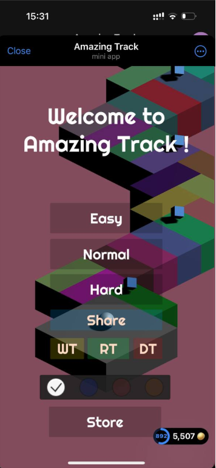
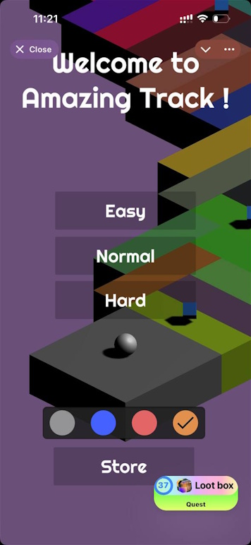

# Startup configuration 

If you think that updating the game's interface is not rational in terms of time costs, you can disable full-screen mode in `startupConfig`.
You can also set the initial position of the overlay on the screen.
`startupConfig` can be modified either through the `index.html` file or directly in your JS files before `PortalSDK.initialize` call.

**Important notice:** because the overlay position saves the position for the user, you maybe will not see the result of changing of initial overlay position.
You need to reset `localStorage` for that. Please refer to [how to enable dev tools in Telegram](/integration/tg-devtools/)

=== "Unity"

	```C#
	window.startupConfig = {
	 isFullscreen: false,
	 overlayPosition: "bottomRight"
	 // "topLeft" | "topRight" | "bottomLeft" |"bottomRight"
	}; 
	```

=== "Defold"

	```LUA
	window.startupConfig = {
	 isFullscreen: false,
	 overlayPosition: "bottomRight"
	 // "topLeft" | "topRight" | "bottomLeft" |"bottomRight"
	}; 
	```

=== "JavaScript"

	```JS
	window.startupConfig = {
	 isFullscreen: false,
	 overlayPosition: "bottomRight"
	 // "topLeft" | "topRight" | "bottomLeft" |"bottomRight"
	}; 


**Expected results**



*Disabled fullscreen*



*Enabled fullscreen*


