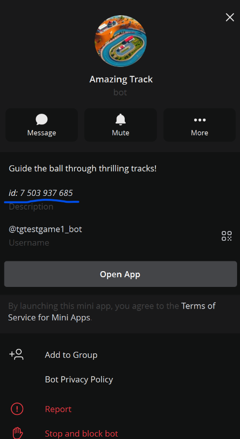

# How to find your game bot ID

To test your game locally, you need to find your game bot ID. This guide shows you how to enable bot ID visibility in Telegram and locate your bot's ID.

### How to enable Bot ID visibility in Telegram

#### 1. Step: Download and launch the Beta Version of Telegram Desktop

Download and launch the Beta Version of Telegram Desktop here <https://desktop.telegram.org/changelog#beta-version>

#### 2. Step: Open the side menu and navigate to Settings > Advanced

Open the side menu and navigate to Settings > Advanced

#### 3. Step: Scroll down the opened menu and click the Experimental settings button

Scroll down the opened menu and click the Experimental settings button.

#### 4. Step: Enable the option "Show Peer ID's in Profile"

Enable the option **"Show Peer ID's in Profile"**

#### 5. Step: View Your Bot ID

Open your game bot in Telegram and you will see the bot ID displayed in the profile.

The ID number shown is your **bot ID** that you'll need for local testing.

### Using the Bot ID

Once you have your bot ID, you can use it in your local testing setup. For instructions on how to configure local testing with your bot ID, see the [Local Testing Guide](/setup/local-testing/).

### Important Notes

- The bot ID is a numeric identifier unique to each bot
- Make sure to use the bot ID from the same mini app where you got your `authData`
- The "Show Peer ID's in Profile" setting is only available in Telegram Desktop and some mobile versions with experimental features enabled
