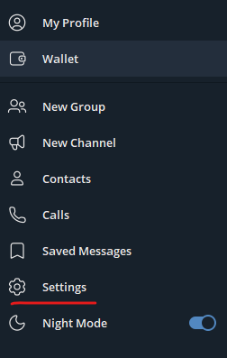
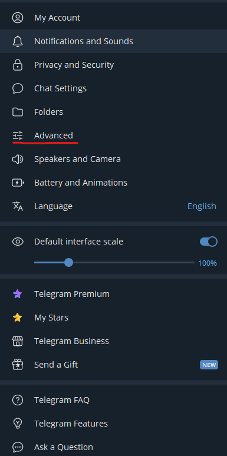
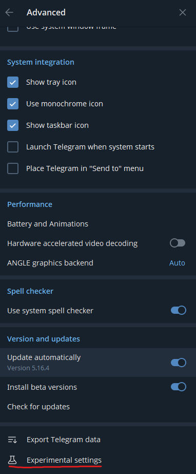
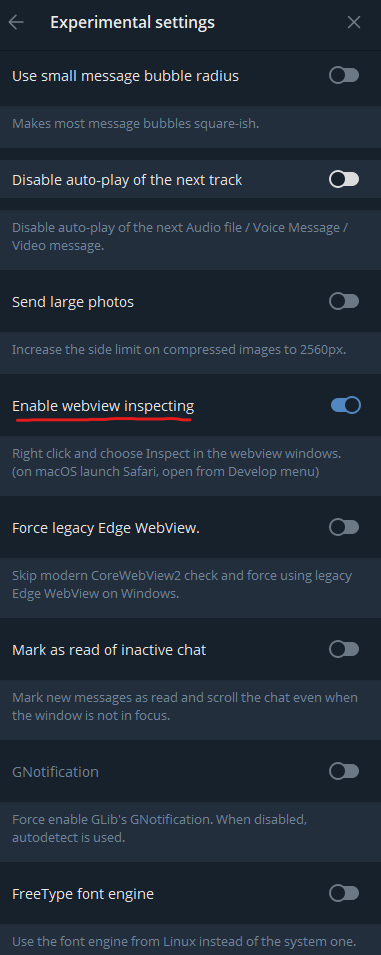
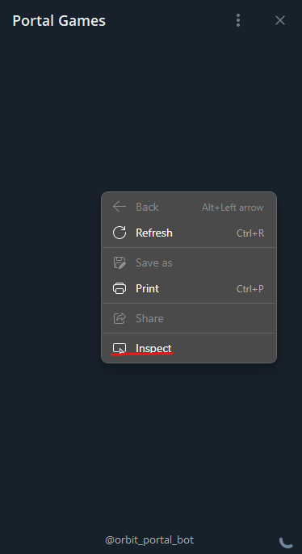

# How to enable dev tools in Telegram

#### 1. Download and launch the Beta Version of Telegram Desktop here <https://desktop.telegram.org/changelog#beta-version>

#### 2. Open the side menu and navigate to `Settings > Advanced`

#### 3. Scroll down the opened menu and click the Experimental settings button.

#### 4. Check the `Enable webview inspecting` option.

#### 5. When the `Enable webview inspecting` is enabled, right-clicking in the Mini App will display a context menu with the Inspect option, allowing you to open developer tools. Or you can use hotkey `F12`

