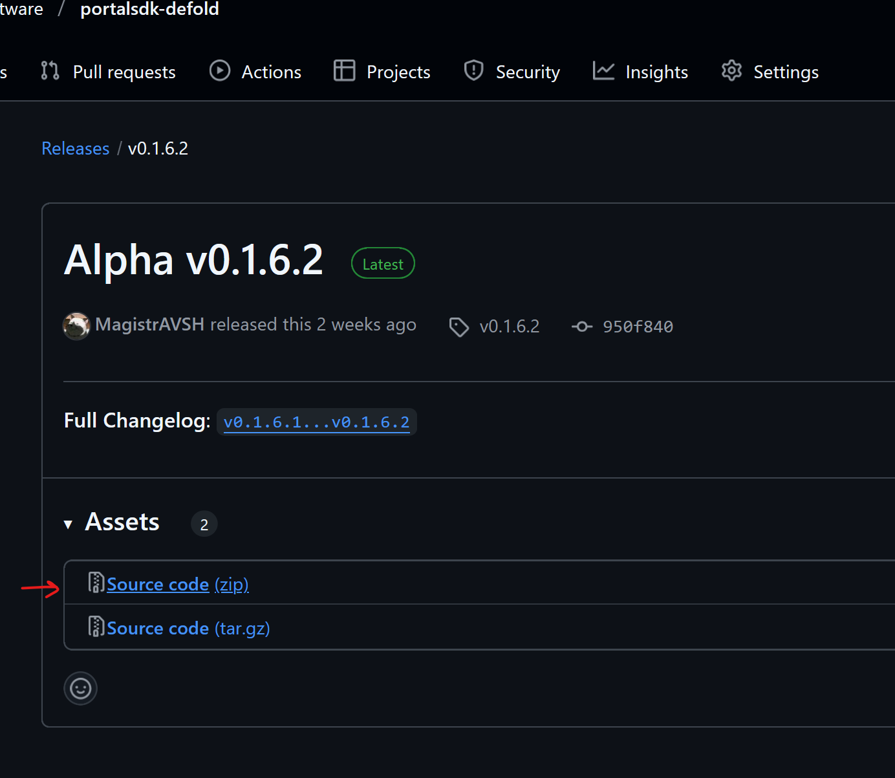

# Defold Engine

### How to install

#### 1. Copy a link from releases on GitHub
[https://github.com/orbit-software/portalsdk-defold/releases](https://github.com/orbit-software/portalsdk-defold/releases)



#### 2. Install into dependencies of `game.project`:
=== "game.project"
```ini
[project]
title = TestGame
version = 1.0
dependencies#0 = https://github.com/orbit-software/portalsdk-defold/archive/refs/tags/v0.1.7.zip
```
#### 3. Set a template for HTML5 export

=== "game.project"
```ini
[html5]
htmlfile = /portalsdk/manifests/web_template/engine_template.html
cssfile = /portalsdk/manifests/web_template/style.css
```

### Examples and sources code

Refer to the example project to see a example of how the API works.

[API Usage Example](https://github.com/orbit-software/portalsdk-defold/blob/master/main/main.script)

The source code is available on GitHub

[PortalSDK Defold](https://github.com/orbit-software/portalsdk-defold)

The API is documented in details:

[Script API](https://github.com/orbit-software/portalsdk-defold/blob/master/portalsdk/api/portalsdk.script_api)

## Local Testing

For instructions on how to test your Defold HTML5 game locally with full PortalSDK functionality (overlay, ads, IAPs), see the [Local Testing Guide](/setup/local-testing/).
