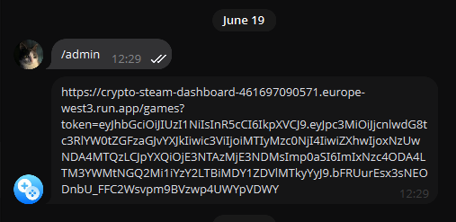
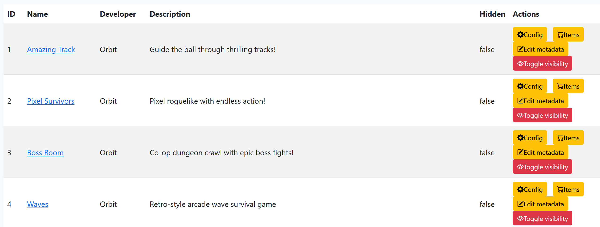
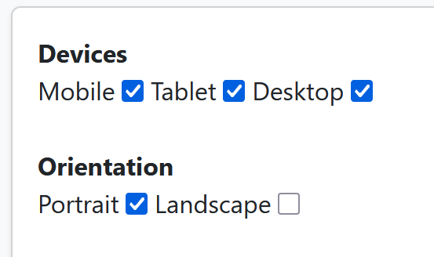
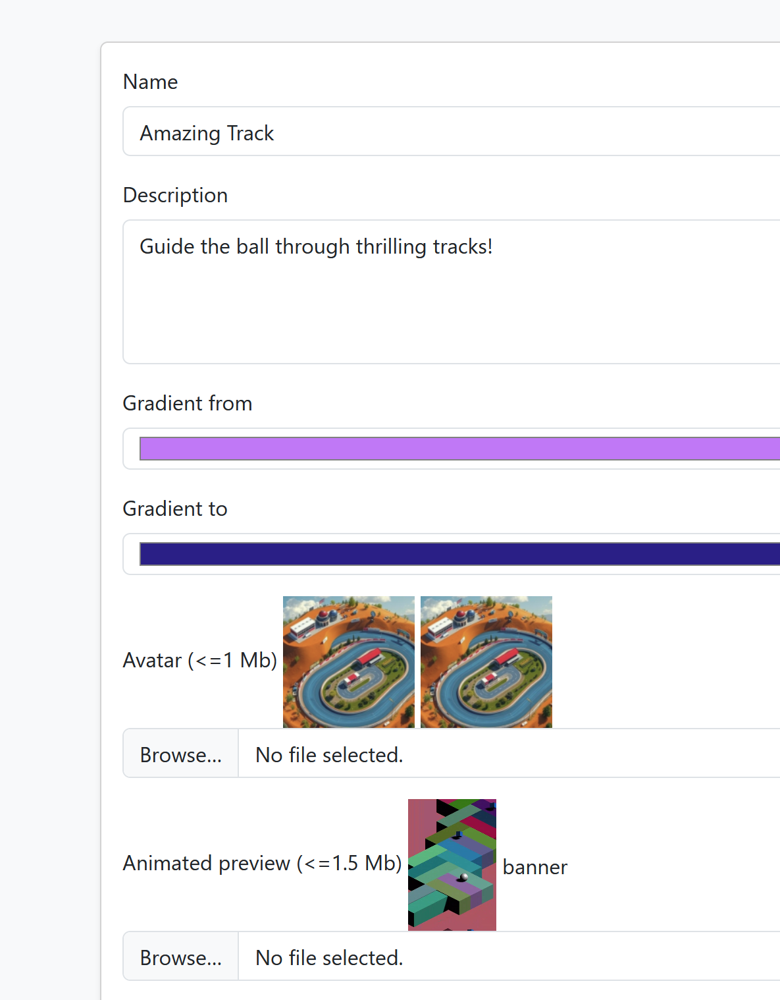
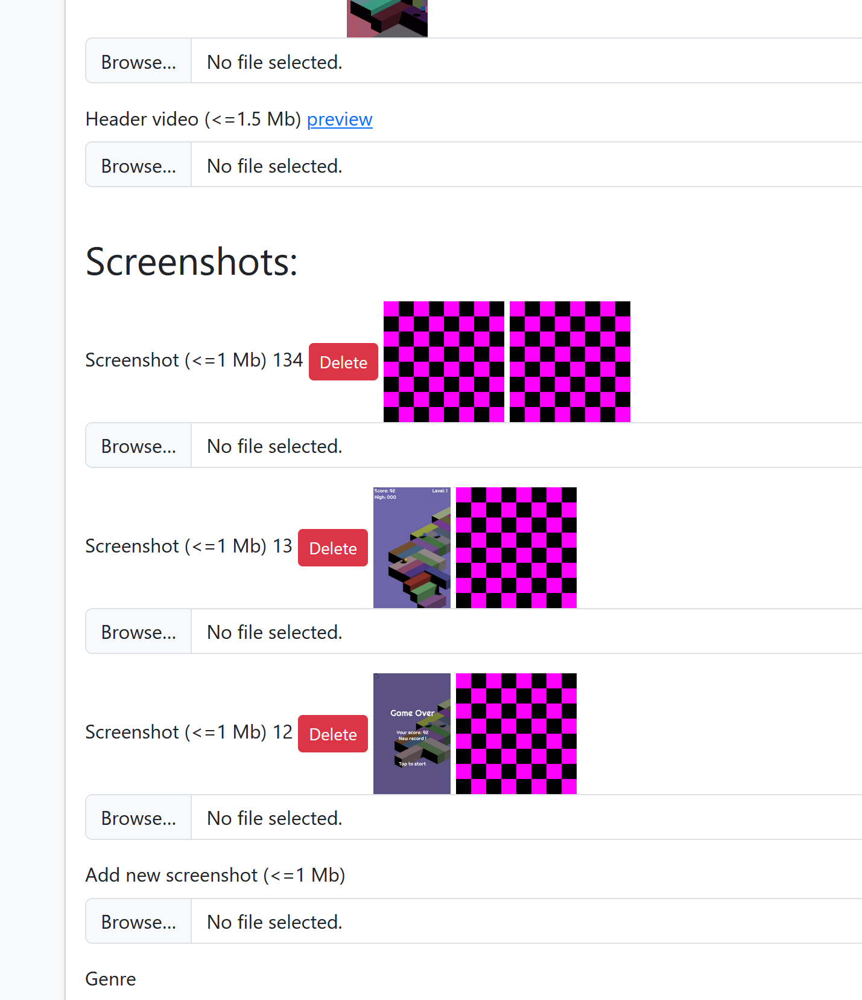

# Admin dashboard

_Note: Access to the dashboard is provided by request and requires your Telegram nickname._

### How to get access ###

#### 1. Send command `/admin` to the Telegram bot  [@orbit_portal_bot](https://t.me/orbit_portal_bot/)
  
#### 2. You will get a link to the admin dashboard where you can administrate your games

### How to add, edit, or remove items

#### 2. Select one of your games and click the store button `Items`

#### 3. You have access to change items, their description, and prices

  
### Change game configuration  
#### 1. Change supported devices and supported screen formats

  

#### 2. Game name, description, colors, ...

#### 3. Screenshots, image, avatars, ...

