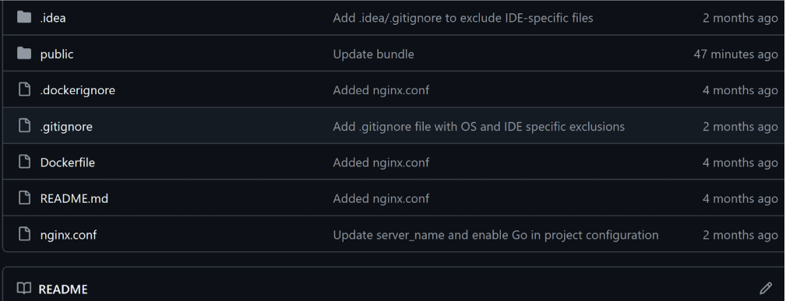
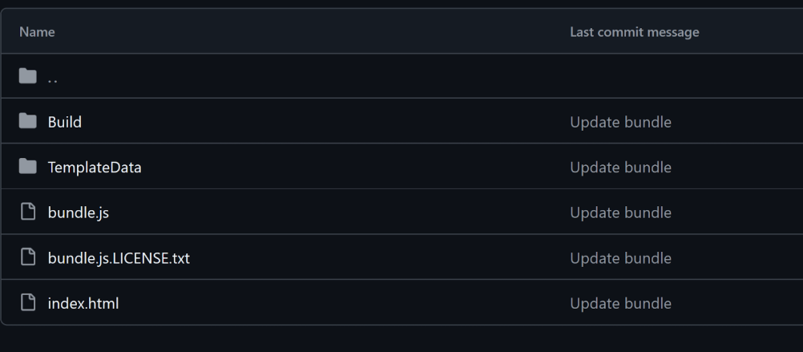
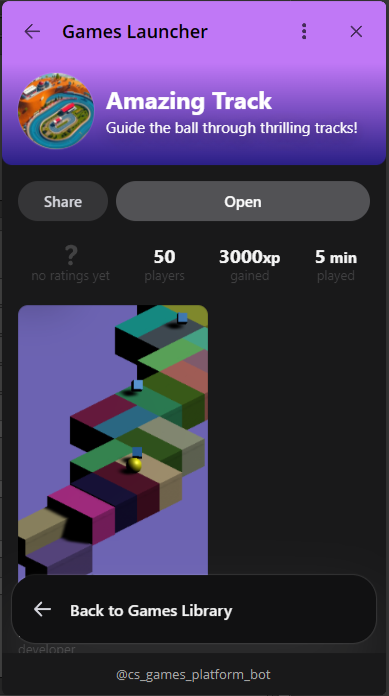

# Upload Games

Note: The upload method is pre-release and subject to change.
To upload games, we use GitHub as the primary platform for managing and storing build files. Simply push your game's build files into the designated /public/ directory. 

How to upload game to platform

1. You will have access to the GitHub repository for the game:

2. Push your build files into /public/ directory

3. After a few minutes your game can be accessed in the game launcher. 

